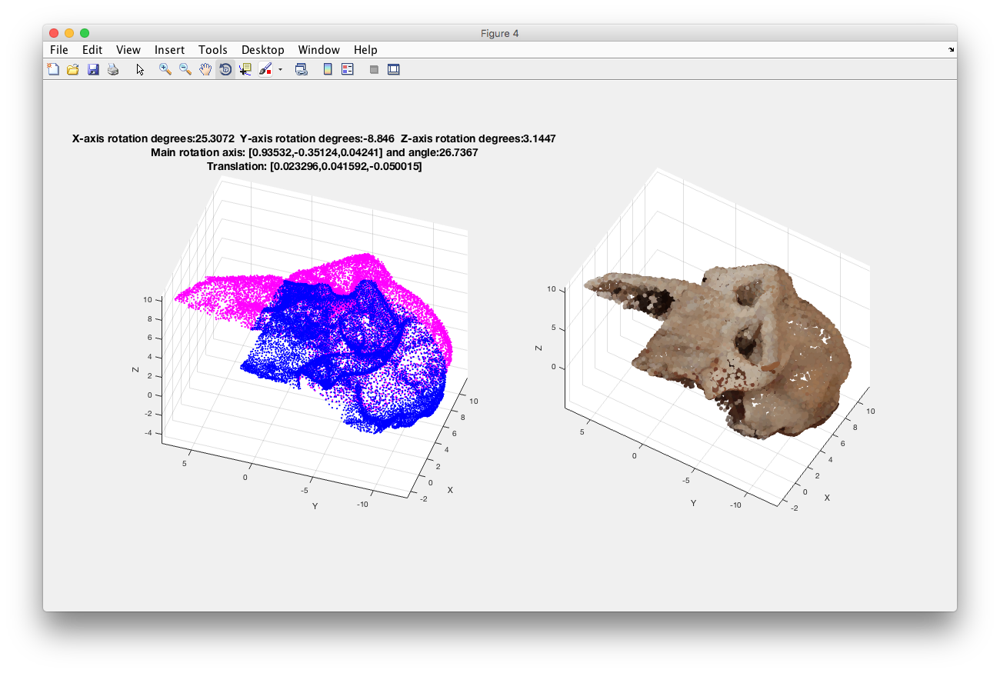
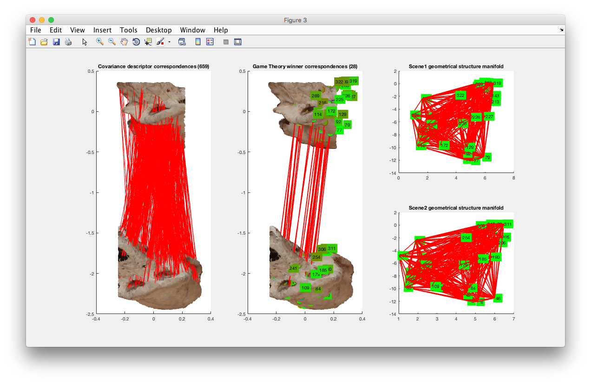

# A 3D Scene Registration Method via Covariance Descriptors and an Evolutionary Stable Strategy Game Theory Solver


## About
This is a Matlab implementation of the method "A 3D Scene Registration Method via Covariance Descriptors and an Evolutionary Stable Strategy Game Theory Solver".

It provides a 3D point cloud descriptor for the local definition of points, fusing shape and color information, based on the notion of covariance of features. The intrinsic properties of this descriptor are many: it is invariant to spatial rigid transformations, and robust to noise and resolution changes; it can also be used for characteristic point detection; and lies on top of a manifold topology which allows the use of analytical metric properties.

The method is complemented with a Game Theory based approach for solving the matching correspondences under global geometric constraints. This offers a comprehensive understanding of the scene and avoids possible mismatches due to repeated areas or symmetries, which would be impossible to identify by the detector solely at a local level.

The full registration approach is able to accurately match different views of a scene under spatial transformations, high noise levels and with small overlap between views.

The method is described in detail in the following publications [IJCV 2015](https://link.springer.com/article/10.1007/s11263-015-0820-2), [3DV 2014](http://ieeexplore.ieee.org/abstract/document/7035869/). Please cite them if you use it in you research and/or applications:

```bibtex
@article{ IJCV2015,
  title={ A 3{D} scene registration method via covariance descriptors and an evolutionary stable strategy game theory solver },
  author={ Cirujeda, Pol and Cid, Yashin Dicente and Mateo, Xavier and Binefa, Xavier },
  journal={ International Journal of Computer Vision (IJCV) },
  volume={ 115 },
  number={ 3 },
  pages={ 306--329 },
  year={ 2015 },
  publisher={ Springer }
}
```

```bibtex
@inproceedings{ 3DV2014,
  title={ {MCOV}: a covariance descriptor for fusion of texture and shape features in 3{D} point clouds },
  author={ Cirujeda, Pol and Mateo, Xavier and Cid, Yashin Dicente and Binefa, Xavier },
  booktitle={ International Conference on 3D Vision (3DV), 2014 },
  volume={ 1 },
  pages={ 551--558 },
  year={ 2014 },
  organization={ IEEE }
}
```

## Usage
The method is targeted at registration of 3D point clouds containing 3D coordinates, vertex normals and colors in RGB space, with provided support for reading and storing results to [Wavefront OBJ files](https://en.wikipedia.org/wiki/Wavefront_.obj_file).

Please check the included ```runme.m``` script for a sample of a method call and parameterisation. All the methods included in this release are pretty much commented and self-explanatory.

A sample scene is included in the ```./Samples``` folder. Otherwise you can check out the [3DVis dataset repository](https://github.com/pcirujeda/3DVis-dataset) in order to get a set of 12 scenes as used in the experimental evaluation sections of the aforementioned publications.

If verbose mode is enabled you will be able to see the different steps of the registration procedure, including scene analysis for keypoint extraction, Covariance Descriptor likelihood matching, Game Theory correspondences calculation and final registration estimation.



## Dependencies
The code uses Andrea Tagliasacchi's [KDtree toolkit](https://github.com/ataiya/kdtree) for efficient search in 3D space.

It is included in ```./KDTrees``` folder. Please use the included ```compileAll.m``` script for building the approppriate MEX files for your platform.

## License & Attribution
This software release is primarily [MIT](https://opensource.org/licenses/MIT) licensed. Some files contain third-party code under other licenses.